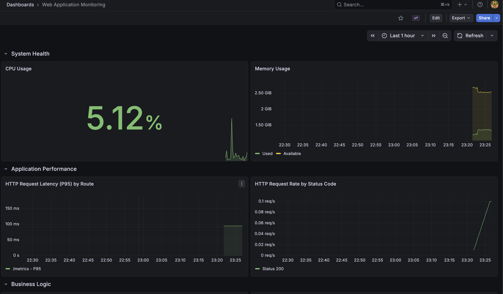

# Web Application Monitoring Stack

A comprehensive monitoring stack to observe a sample web application using Prometheus, Grafana, Node Exporter, and Alertmanager.

## Architecture

This project spins up the following services using Docker Compose:

- **Web Application (`web-app`)**: A Node.js Express application instrumentation with `prom-client` exposing default Node.js metrics, HTTP request metrics, and custom business logic counters (`app_user_signups_total`, `app_user_signup_failures_total`).
- **Nginx (`nginx`)**: Acts as a reverse proxy to the Node.js application, also exposing `stub_status` for monitoring connection stats.
- **Nginx Exporter (`nginx-exporter`)**: Connects to Nginx `stub_status` and exports metrics to Prometheus.
- **Prometheus (`prometheus`)**: The core time-series database scraping metrics from the Web App, Nginx Exporter, Node Exporter, and itself. Also evaluates alerting rules.
- **Node Exporter (`node-exporter`)**: Exposes hardware and OS metrics of the host machine. (Runs on port `9101` to avoid common port conflicts).
- **Alertmanager (`alertmanager`)**: Handles alerts triggered by Prometheus and routes them (configured for Slack incoming webhooks).
- **Grafana (`grafana`)**: Visualization platform for the scraped metrics. Comes pre-provisioned with data sources and a comprehensive dashboard.

## Requirements

- Docker
- Docker Compose

## Getting Started

1. **Clone the repository**:
   ```bash
   git clone <repository_url>
   cd <repository_dir>
   ```

2. **Configure Alertmanager (Optional but recommended)**:
   - Edit `alertmanager/alertmanager.yml`
   - Replace the Slack `api_url` and `channel` placeholders with your actual Slack Webhook setup.

3. **Start the stack**:
   ```bash
   docker compose up -d
   ```

4. **Access the Services**:
   - **Sample Web App**: `http://localhost:80` (via Nginx) or `http://localhost:8080` (Direct)
   - **Prometheus UI**: `http://localhost:9091`
   - **Alertmanager UI**: `http://localhost:9093`
   - **Grafana UI**: `http://localhost:4000`
     - Default credentials: `admin` / `admin`

## Dashboards

A unified dashboard named **Web Application Monitoring** is provisioned automatically in Grafana, featuring:
- **System Health**: CPU & Memory usage.
- **Application Performance**: HTTP Request Latency (P95) and Request Rate by Status Code.
- **Business Logic**: Total User Signups and Failures.

The picture below shows the dashboard system health:



This dashboard is used to monitor the health and performance of an application or server in real time
## Generating Test Data

To generate data for the business logic dashboard panels, send a few POST requests to the sample signup API:

```bash
# Generate signup traffic (80% success rate simulated)
curl -X POST http://localhost:8080/api/signup
```

Then, view the raw metrics:
```bash
curl http://localhost:8080/metrics
```
